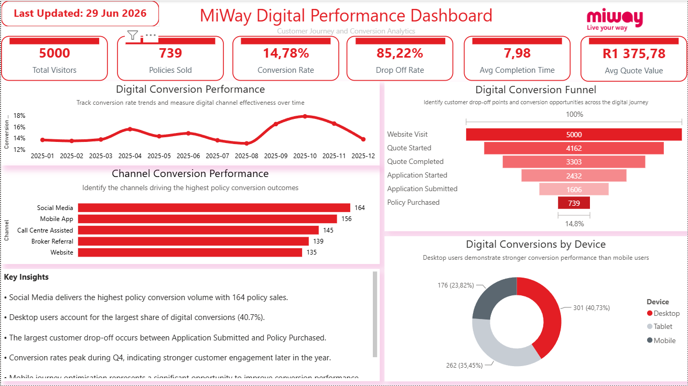
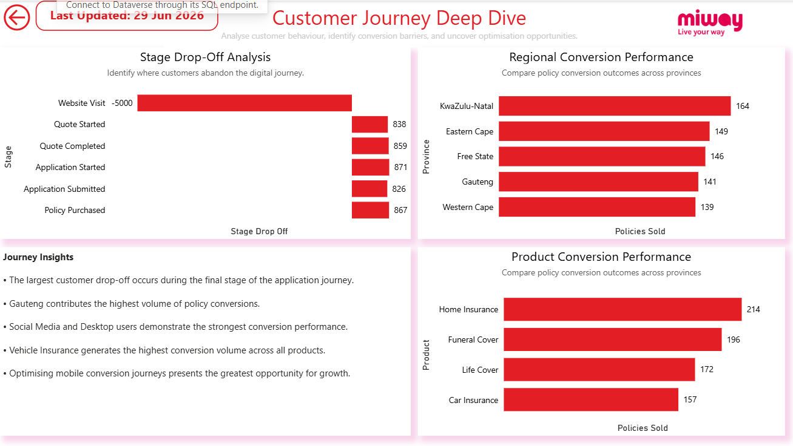
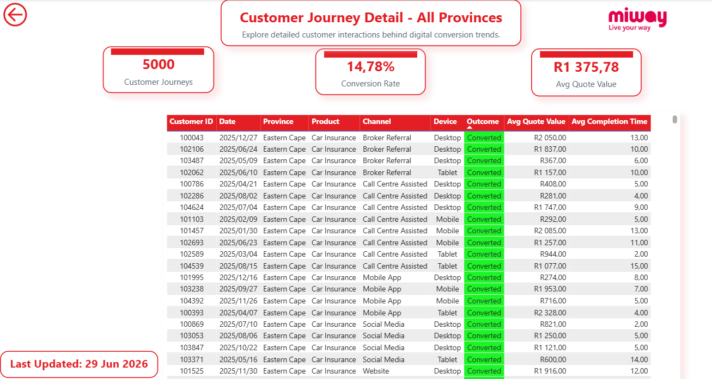
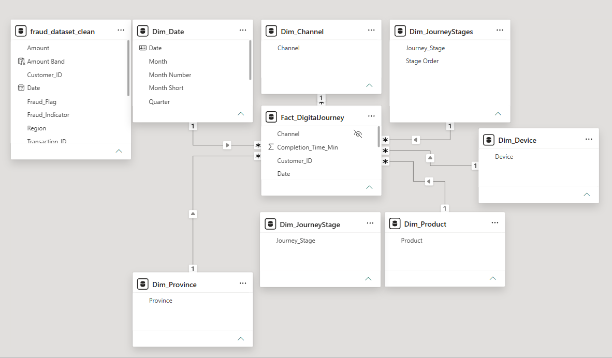

# miway-digital-performance-dashboard
Power BI dashboard analysing digital marketing performance, customer journey, conversion optimisation and business insights for an insurance organisation.

## Project Overview
This Power BI dashboard analyses digital customer journey performance for an insurance business, focusing on acquisition, engagement, conversion, and drop-off across key digital channels.

## Business Objective
To help stakeholders understand where customers drop off in the quote-to-policy journey, identify underperforming channels or devices, and recommend data-driven actions to improve conversion and campaign ROI.

## Dashboard Pages
1. Executive Summary
2. Customer Journey Analysis
3. Deep Dive Analysis
4. Drill Through Page

## Key Metrics
- Total Sessions
- Quote Starts
- Applications Submitted
- Policies Purchased
- Conversion Rate
- Drop-off Rate
- Cost per Conversion
- Campaign ROI

## Tools Used
- Power BI
- Power Query
- DAX
- Excel
- Data Modelling

## Key Insights
- The largest drop-off occurs between application submitted and policy purchased.
- Mobile users show strong engagement but lower final conversion.
- Paid search performs well for acquisition, while direct and organic channels show stronger conversion quality.
- Regional and device-level analysis highlights opportunities for targeted optimisation.
=========================================================================================

01  # Executive Summary

## Purpose

The Executive Summary provides senior stakeholders with a consolidated view of MiWay's digital marketing performance across the customer acquisition journey. It combines key performance indicators, campaign effectiveness, customer behaviour, and conversion metrics into a single dashboard that supports strategic decision-making and continuous optimisation.

## Business Value

This dashboard enables decision-makers to:

- Monitor digital acquisition and conversion performance.
- Evaluate campaign effectiveness across marketing channels.
- Identify customer journey bottlenecks.
- Compare performance across regions and devices.
- Track business-critical KPIs in real time.
- Prioritise optimisation initiatives based on measurable outcomes.

## Executive KPIs

- Website Sessions
- Quotes Started
- Applications Submitted
- Policies Purchased
- Conversion Rate
- Drop-off Rate
- Cost per Conversion (CPC)
- Campaign Return on Investment (ROI)

## Executive Visuals

The Executive Summary includes:

- KPI Cards
- Customer Journey Funnel
- Digital Performance Trend
- Channel Performance Comparison
- Regional Performance Analysis
- Device Performance Breakdown

## Key Business Insights

- Digital acquisition is performing well, indicating strong campaign reach and customer awareness.
- The largest customer drop-off occurs between **Application Submitted** and **Policy Purchased**, suggesting friction in the final stages of the customer journey.
- Mobile devices generate the highest traffic volumes but convert at a lower rate than desktop users.
- Organic and Direct channels produce stronger conversion quality despite lower overall traffic.
- Regional performance varies, presenting opportunities for targeted optimisation strategies.

## Business Recommendations

- Investigate customer abandonment between application submission and policy purchase.
- Improve the mobile application experience through usability enhancements.
- Increase investment in high-performing acquisition channels while optimising lower-performing campaigns.
- Implement A/B testing on landing pages, forms, and calls-to-action.
- Integrate behavioural data from GA4, GTM, CRM, and policy administration systems for richer customer journey analysis.

## Executive Decisions Supported

This dashboard supports strategic decisions relating to:

- Digital marketing investment
- Customer acquisition optimisation
- Conversion rate improvement
- Campaign performance management
- Regional marketing strategy
- Digital channel optimisation

=========================================================================================
  # Customer Journey Analysis

## Purpose

The Customer Journey Analysis page provides a detailed view of how customers progress through MiWay's digital sales funnel. It highlights customer movement across each stage of the journey, identifies conversion bottlenecks, and enables stakeholders to understand where customers disengage before completing a policy purchase.

## Business Value

This dashboard enables business stakeholders to:

- Visualise customer progression across the digital sales journey.
- Identify stages with the highest customer abandonment.
- Compare conversion performance across regions.
- Analyse customer behaviour by marketing channel and device.
- Support targeted initiatives that improve customer experience and conversion rates.

## Journey Stages

The dashboard tracks customer progression through the following stages:

- Website Visit
- Quote Started
- Quote Completed
- Application Submitted
- Policy Purchased

Monitoring these stages helps identify where customers encounter friction and where optimisation efforts should be prioritised.

## Visuals Included

- Customer Journey Funnel
- Stage Drop-off Analysis
- Regional Conversion Performance
- Channel and Device Conversion Matrix
- Journey Stage Performance KPIs

## Key Business Insights

- The greatest customer drop-off occurs between **Application Submitted** and **Policy Purchased**, indicating potential friction during the final purchase stage.
- Mobile devices generate the highest traffic volumes but convert at a lower rate than desktop users.
- Organic and Direct channels deliver stronger conversion quality despite lower acquisition volumes.
- Regional conversion rates vary, highlighting opportunities for targeted marketing and customer experience improvements.
- Funnel analysis clearly identifies the stages where optimisation efforts will have the greatest business impact.

## Business Recommendations

- Review the application and purchase journey to identify usability or process barriers.
- Simplify online forms and reduce unnecessary customer effort before policy purchase.
- Optimise the mobile experience to improve final conversion rates.
- Increase investment in channels that consistently generate higher-quality conversions.
- Continuously monitor funnel performance after implementing improvements to measure business impact.

## Executive Decisions Supported

This analysis supports decisions relating to:

- Customer Journey Optimisation
- Digital Conversion Improvement
- Marketing Channel Performance
- Regional Marketing Strategy
- Customer Experience Enhancement
- Revenue Growth through Increased Conversion

## Recommendations
- Investigate friction points between application submission and policy purchase.
- Use A/B testing to optimise CTAs and landing page forms.
- Improve mobile journey usability.
- Track customer behaviour using GA4, GTM, CRM, and policy administration system data.

=========================================================================================
  # Deep Dive Analysis

## Purpose

The Deep Dive Analysis page enables business users to move beyond high-level performance metrics and investigate the underlying drivers of digital marketing performance. It provides detailed analysis across customer segments, acquisition channels, devices, regions, and campaign performance, allowing stakeholders to identify opportunities for optimisation and make evidence-based decisions.

## Business Value

This analysis enables stakeholders to:

- Investigate performance beyond executive-level KPIs.
- Identify trends, anomalies, and conversion opportunities.
- Compare campaign performance across multiple dimensions.
- Understand customer behaviour at a more granular level.
- Support targeted optimisation initiatives using detailed operational insights.

## Analytical Focus Areas

The dashboard provides detailed analysis through:

- Channel Performance Analysis
- Device Performance Comparison
- Regional Performance Analysis
- Campaign Performance Trends
- Customer Segment Analysis

Each visual supports interactive filtering and enables users to isolate specific business scenarios for further investigation.

## Drill Through Capability

The dashboard includes an interactive Drill Through feature that allows users to navigate from summary visuals into detailed transactional information.

The drill-through experience enables users to:

- Investigate specific customer segments.
- Analyse campaign performance in greater detail.
- Review regional conversion performance.
- Explore customer behaviour by acquisition channel.
- Support root cause analysis for performance anomalies.

## Key Business Insights

- Customer behaviour varies significantly across acquisition channels.
- Desktop users consistently achieve higher conversion rates despite lower traffic volumes.
- Certain regions demonstrate stronger policy conversion performance than others.
- Campaign effectiveness differs across channels, highlighting opportunities for budget optimisation.
- Drill-through analysis enables rapid investigation of performance exceptions and emerging trends.

## Business Recommendations

- Increase investment in consistently high-performing acquisition channels.
- Optimise campaigns with high traffic but low conversion rates.
- Develop region-specific marketing strategies where conversion performance differs.
- Use drill-through analysis as part of regular campaign performance reviews.
- Continuously monitor detailed performance metrics to identify optimisation opportunities before they impact business performance.

## Executive Decisions Supported

This page supports decisions relating to:

- Campaign Optimisation
- Budget Allocation
- Customer Segmentation
- Regional Marketing Strategy
- Digital Performance Improvement
- Conversion Rate Optimisation

=========================================================================================
  # Data Model

## Purpose

The Data Model provides the analytical foundation for the MiWay Digital Performance Dashboard. It organises transactional and reference data into a scalable, business-friendly structure that enables accurate reporting, consistent KPI calculations, and efficient dashboard performance.

## Architecture

The dashboard follows a **Star Schema** design, with a central fact table connected to multiple dimension tables. This approach improves query performance, simplifies report development, and supports reusable business metrics across all dashboard pages.

### Fact Table

**Fact_DigitalPerformance**

The fact table captures transactional and performance-related metrics, including:

- Website Sessions
- Quotes Started
- Applications Submitted
- Policies Purchased
- Marketing Spend
- Revenue
- Conversion Metrics

### Dimension Tables

The solution includes the following dimensions:

- **Dim_Date** – Supports time-based analysis and trend reporting.
- **Dim_Channel** – Classifies customer acquisition channels (Organic, Paid Search, Social, Direct, Email).
- **Dim_Device** – Enables analysis by Desktop, Mobile, and Tablet.
- **Dim_Region** – Supports regional performance comparisons.
- **Dim_Campaign** – Provides campaign-level segmentation and performance analysis.

## Relationships

One-to-many relationships connect each dimension table to the central fact table.

This model enables:

- Consistent filtering across reports.
- Accurate KPI calculations.
- Reduced data duplication.
- Improved report performance.
- Simplified maintenance and scalability.

## Modelling Principles

The model was designed using dimensional modelling best practices:

- Star Schema architecture.
- Separate fact and dimension tables.
- Reusable dimensions across all report pages.
- Single source of truth for business KPIs.
- Optimised relationships for efficient filtering and navigation.

## Business Benefits

The data model enables:

- Faster dashboard performance.
- Consistent business metrics.
- Reliable executive reporting.
- Simplified report maintenance.
- Scalable analytics for future enhancements.
- Improved user experience through efficient filtering and drill-through functionality.

## Technical Skills Demonstrated

- Data Modelling
- Star Schema Design
- Relationship Management
- Power Query
- DAX
- Power BI
- KPI Standardisation
- Business Intelligence Architecture
